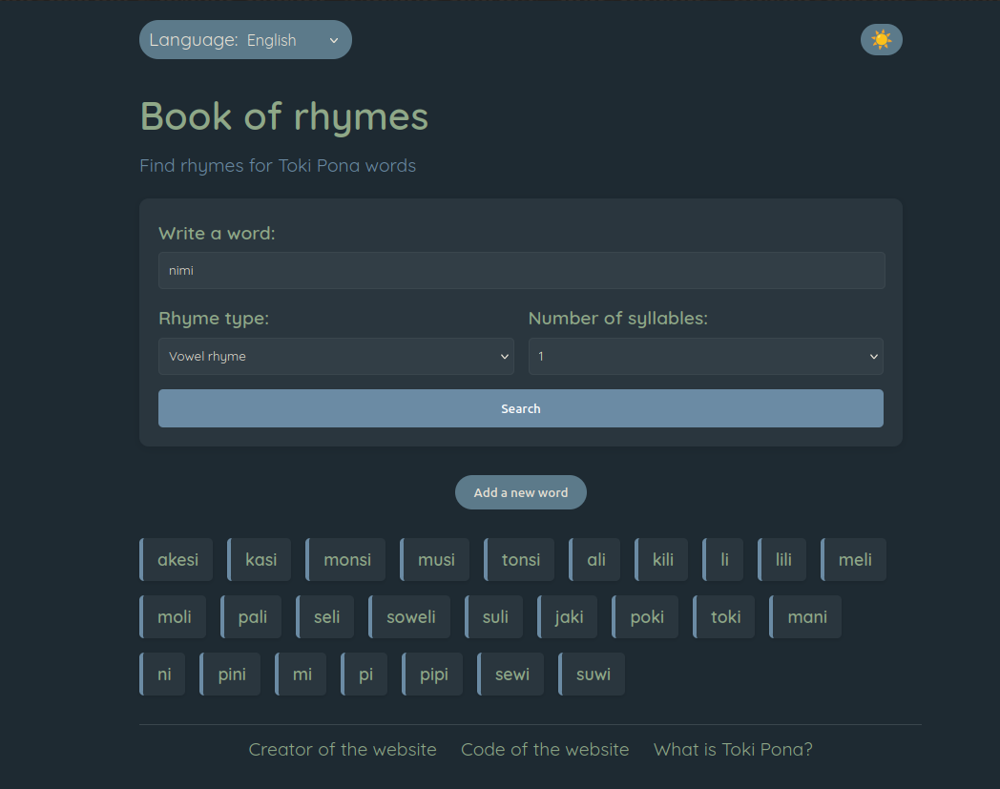

# lipu pi nimi sama 📖

ni li lipu pona a
\
sina pana e nimi la lipu pi nimi sama li pana e nimi pi kalama sama
\
ni li pona tawa musi pi toki lili tawa musi kalama

## ken pi lipu ni

sina ken lukin e lipu ni kepeken

- toki Inli (English)
- toki Katejano (Español)
- toki Kanse (Français)
- toki pona

sina kepeken lipu ni la sina ken:

- wile e sama pi kalama poka anu sama pi kalama sama
- wile e nanpa pi kalama pini tawa sama

ale ni li pana e ken mute tawa sina
\
\
sina pana e wile sina lon poka open la sina lukin e nimi lon poka pini
\
sina ken lukin e lipu lon ni:


## mi wile jo e lipu ni lon ilo tomo mi

sina wile ni la o pali e ni:

```bash
git clone https://github.com/inestrivino/lipu-pi-nimi-sama.git
```

anu kepeken ilo "Download Zip"
\
tenpo kama la pali ni li pini la sina kepeken lipu "index.html" la sina ken kepeken lipu pi nimi sona lon ilo tomo sina

## mi wile pana tawa lipu ni

ni li pona
\
o pana e wile sina lon ilo "Issues"
\
o pana e pali sina lon ilo "Branch" sin. ni li pini la o kepeken ilo "Pull Request"

## alasa sona

- toki pona li seme:
  - toki pona li toki pona. ona li jo e nimi pi mute ala
- sina li seme:
  - lipu ni li tan jan Ine (Inés). mi jan pi kama sona. mi kama sona e nanpa e toki pona. tenpo pini la mi wile pali e lipu ni tan ni: mi wile pona e ken mi

\
lipu ni li pona tawa sina la ni li pona tawa mi
\
sina wile pana e pilin pona tawa mi la o pali e ni:

- pana e mun tawa ni ⭐
- toki e lipu ni tawa jan pona sina 💬
